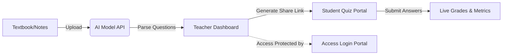

<div align="center">

# 🌌 Nex AI Exams
### *The Intelligent, Secure, Full-Stack Examination Engine*

[](https://unit-test-gen.onrender.com)
[](https://nodejs.org/)
[](LICENSE)
[](https://github.com/)

**Nex AI Exams** compiles raw educational course material, textbook chapters, or lecture notes into professionally structured tests in seconds, featuring real-time submission metrics and secure administration.

[Demo & Setup](#-quick-start) • [Core Features](#-features) • [Platform Architecture](#-architecture)

</div>

---

## ⚡ Features

* **🔮 AI Assessment Compiler**
  * Auto-generates Multiple Choice (MCQ), True/False, Short Essay, and Problem Solving questions directly from your uploads.
  * Adjusts question ratios, points allocation, and time limits dynamically.
* **🪐 Deep Space Visual Interface**
  * Premium, responsive interface featuring glassmorphic panels and glow animations.
  * Native system-matching Light & Dark parchment themes.
* **🔒 Gatekeeper Security middleware**
  * Dashboard, history logs, and grades are secured using custom administrator session tokens.
  * Student portals (`/view.html`) require no login—only a name and roll number.
* **📡 Real-Time Analytics Dashboard**
  * Submissions logs collect and display student percentage rankings.
  * Per-question review modal highlighting chosen vs. correct answers.
* **🔗 Dynamic Sharing & LAN Resolution**
  * Automatically resolves network IP to generate local Wi-Fi share links and scanable QR codes.
  * Secure public secure tunneling powered by localhost.run is built-in.

---

## 📐 Architecture



---

## 🚀 Quick Start

### 1. Install Project
```bash
npm install
```

### 2. Configure Credentials (`.env`)
Create a `.env` file in the root folder:
```env
# AI Model Authentication
HUGGINGFACE_API_KEY=your_key_here

# Administration Access
TEACHER_USERNAME=admin
TEACHER_PASSWORD=admin123
```

### 3. Start Local Environment
```bash
node server.js
```
* **Dashboard Access:** `http://localhost:3000/login.html`
* **Student Interface:** `http://localhost:3000/view.html`

---

<div align="center">
Designed for modern classrooms and secure test execution.
</div>
